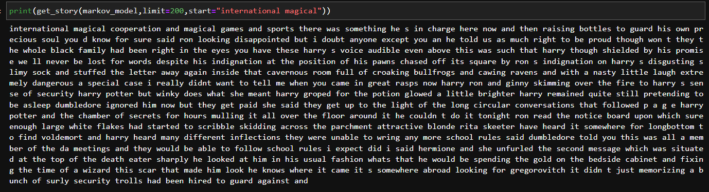
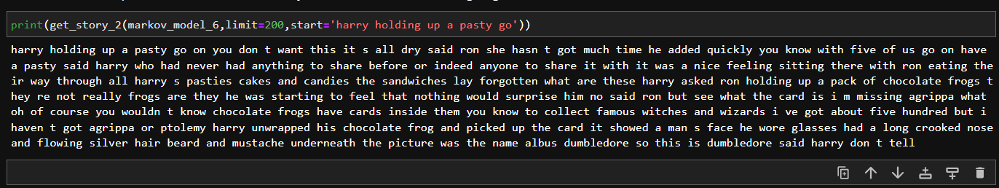

# Potteresque-TaleForge

Potteresque-TaleForge is a Markov Chain-based story generator project that conjures up fictional tales inspired by the magical world of Harry Potter. The project offers flexibility by allowing users to choose between a second-order Markov Chain, capturing word dependencies at a basic level, and a more intricate sixth-order model. This enhancement aims to elevate the context and coherence of the generated stories, immersing readers in Potteresque adventures.

## Features

- Markov Chain Models: Utilizes both second-order and sixth-order Markov Chain models.
- Harry Potter Universe: Generates tales inspired by the enchanting world of Harry Potter.
- Story Generation: Conjures Potteresque adventures based on learned patterns from input text.

## Implementation Examples

## Contributions

Potteresque-TaleForge is a solo project, and your contributions are highly welcomed! Whether you have suggestions, bug reports, or feature requests, your input is valuable in enhancing the project. Feel free to contribute.

